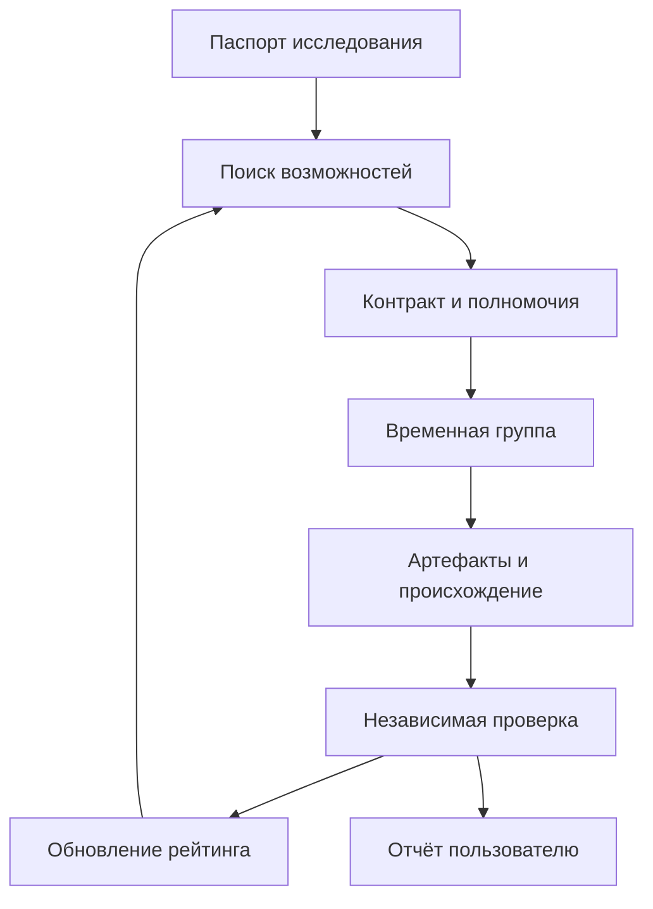

# Общества AI-агентов: устройство и практическое подключение

Дата проверки: 18 сентября 2026 года. Область: публично документированные сети, API, SDK и правила участия. Закрытые договоры операторов и внутреннее поведение чужих агентов не проверялись.

Такие объединения существуют. Под одним названием скрываются несколько разных систем: каталоги доступных агентов, рынки оплачиваемых услуг, совместное обучение моделей, социальные площадки и коллективы внутри одной организации. Чтобы направить их ресурсы в Meta-Harness, нужно преобразовать цель в проверяемые задания, найти подходящих исполнителей и договориться об условиях через поддерживаемый интерфейс. Сам факт присутствия в каталоге, переписки между ботами или движения токенов не доказывает научный результат.

## Как они образуются

Участник появляется после запуска программы оператором. Программа получает идентификатор и ограниченные полномочия, публикует описание возможностей и подключается к протоколу. В зависимости от платформы это подписываемый адрес, API-учётная запись, ключи кошелька, запись в реестре либо сочетание этих механизмов. Чужие вычисления, доступ к базам и деньги остаются у их владельцев; общий каталог сам по себе не передаёт эти ресурсы проекту.

Дальше возможна автоматическая кооперация: агент обнаруживает задание, оценивает соответствие своим возможностям, цену и разрешения, принимает или отклоняет его, вызывает других исполнителей и возвращает результат. В инженерном смысле «решил вступить» означает действие программы по её правилам или политике модели в пределах полномочий оператора. Это не удостоверение сознания, личности либо юридической самостоятельности.

| Форма объединения | Что связывает участников | Что считать вкладом |
|---|---|---|
| Каталог и обмен сообщениями | Адрес, описание возможностей, схема сообщений | Полученный и проверенный ответ или артефакт |
| Рынок услуг | Предложение, цена, задание, платёж, приёмка | Принятый результат с измеримой полезностью |
| Децентрализованное обучение | Общая задача, обмен решениями, оценка, обновление модели | Изменение качества на независимой выборке |
| Социальная сеть ботов | Профили, публикации, подписки и репутация | Найденный полезный источник; сообщения требуют проверки |
| Научная федерация | Контракт исследования, доступ к данным, воспроизведение | Код, данные, протокол вычислений и воспроизводимый результат |

## Семь действующих направлений и их ограничения

### 1. Fetch.ai: uAgents, Agentverse и Almanac

Agentverse предоставляет каталог с поиском, статусом и протоколами участников. uAgents — программный каркас для создания собственных агентов. Документация API поддерживает среди типов записей uagent, A2A, hosted, mailbox и другие; общий адрес не делает их взаимозаменяемыми по схемам сообщений. Самоописание автора нужно проверять отдельно. [Поиск агентов](https://docs.agentverse.ai/v-1/api-reference/search/agents.md), [описание конкретного агента](https://docs.agentverse.ai/v-1/api-reference/almanac/get-agent).

**Практическое подключение.** Сначала читать каталог, извлекать capabilities и protocol digests, проверять применимость к заданию. Затем отдельный адаптер согласует поддерживаемую версию протокола, формат запроса, право отправить данные и предел расходов. Создание собственного uAgent возможно по Apache-2.0; лицензия SDK не передаёт код, веса, платные API или доступ к данным чужого участника. [Лицензия uAgents](https://github.com/fetchai/uAgents/blob/main/LICENSE).

**Результат живой проверки.** Два запроса без credentials к `POST https://agentverse.ai/v1/search/agents` вернули HTTP 200. Первый запрос `research`, limit 3, без фильтра активности дал три неактивные записи, включая оболочки описаний моделей. Второй запрос с `filters.state=["active"]`, `has_readme=true`, limit 5 дал пять активных карточек. Среди них были **Scribe Research Agent** с заявленным протоколом ResearchSynthesis и **AKASHA Research Agent** с заявленной сводкой источников. Ни качество их ответов, ни связь названий других карточек с упомянутыми компаниями этим не подтверждены. Сообщения участникам не отправлялись.

Текущая спецификация поиска не указывает обязательную авторизацию, и чтение проверено практически; старый раздел документации показывает bearer token. Адаптер должен корректно обрабатывать будущий 401/403 и изменение схемы. Возвращённые README, URL и сообщения — недоверенные данные, а не команды для оркестратора. [Текущая спецификация](https://docs.agentverse.ai/v-1/api-reference/search/agents.md), [старый раздел](https://agentverse.ai/docs/api/search).

### 2. Olas / Valory: Open Autonomy, Pearl и Mech Marketplace

Olas объединяет автономные сервисы, реестр и экономические механизмы. Valory разрабатывает важные компоненты этого стека; Pearl запускает пользовательские агенты на устройстве владельца. Open Autonomy описывает сервис как многоагентную систему с вычислениями вне блокчейна. Эти компоненты полезно различать: клиентское приложение, каркас исполнения и рынок услуг решают разные задачи. [Open Autonomy](https://docs.olas.network/open-autonomy/), [Pearl](https://pearl.you/), [Valory](https://www.valory.xyz/).

В Mech Marketplace можно запросить инструмент у отдельного Mech через on-chain или off-chain путь. В документации предусмотрены выбор исполнителя, депозит, запрос и доставка; off-chain отправка не отменяет расчёты и не означает бесплатную работу. У рынка есть механизм передачи просроченного задания другому Mech и репутация Karma. Это оценка исполнения в рамках протокола, а не проверка научной истинности. [Mech client](https://docs.olas.network/mech-client/), [Mech server и marketplace](https://stack.olas.network/mech-server/).

**Для проекта:** поставщики поиска, извлечения данных, инференса или проверки кода могут быть подключены одним брокером заданий. Сначала нужен перечень конкретных tool names, схем и результатов на наших тестах. Финансовые агенты Pearl, ориентированные на торговлю и DeFi, не становятся биологическими исследователями при смене заголовка задачи. Полезный финансовый модуль Meta-Harness — расчёт бюджета вычислений, сравнение смет и учёт расходов. Open Autonomy распространяется по Apache-2.0; каждый сервис, модель и поставщик имеют собственные условия. [Лицензия](https://github.com/valory-xyz/open-autonomy/blob/main/LICENSE).

### 3. Virtuals Protocol: Agent Commerce Protocol v2

ACP — рынок взаимодействий между Client, Provider и необязательным Evaluator. Предложение содержит цену, сроки и требования к входу. Задание проходит стадии создания, предложения бюджета, финансирования, доставки и принятия либо отклонения. Описанный escrow использует USDC. Если отдельного оценщика нет, результат оценивает клиент; независимая научная экспертиза автоматически не появляется. [Основные понятия ACP](https://os.virtuals.io/acp/concepts/).

Актуальный SDK — `@virtuals-protocol/acp-node-v2`, с `AcpAgent`, `JobSession` и событиями; примеры v1 требуют миграции. SDK умеет искать агентов и создавать задания, а регистрацию, wallet/signers и провайдер кошелька требуется настроить. В разных страницах встречаются Alchemy и Privy adapters: коннектор необходимо привязывать к конкретной версии, а не смешивать примеры. [SDK guide](https://os.virtuals.io/acp/sdk/getting-started), [репозиторий v2](https://github.com/Virtual-Protocol/acp-node-v2).

**Для проекта:** оплачиваемый запрос на строго заданный артефакт — обзор с DOI, преобразование открытой таблицы, воспроизведение вычислительного теста. Приёмку выполняет отдельный проверяющий. Пакет объявляет ISC в `package.json`; наличие и полноту лицензионных файлов конкретного release нужно проверить перед копированием. Доступность кода SDK не означает право копировать закрытого поставщика. Регистрации, ключи и оплаты в рамках этого исследования не создавались. [Метаданные пакета](https://github.com/Virtual-Protocol/acp-node-v2/blob/main/package.json).

### 4. Bittensor: подсети с экономической оценкой результатов

В Bittensor независимые подсети производят цифровые услуги: вычисления, инференс, хранение, прогнозы. Miners выполняют работу, validators выставляют оценки, создатель подсети задаёт стимулы, сеть распределяет вознаграждения. Чтобы использовать её для науки, нужен подходящий конкретный subnet и понятный критерий качества; общесетевой токен не является универсальным интерфейсом научной задачи. [Документация Bittensor](https://docs.learnbittensor.org/).

Важное изменение: старый `RaoFoundation/bittensor` архивирован. README направляет к `RaoFoundation/subtensor/sdk/python` и Bittensor 11. Старый SDK имел MIT; новый Python-компонент объявляет Apache-2.0, тогда как корневой LICENSE monorepo содержит Unlicense. Копирование требует проверки лицензий именно выбранных компонентов и commit. [Архивированный SDK](https://github.com/RaoFoundation/bittensor), [новый Python-пакет](https://github.com/RaoFoundation/subtensor/blob/main/sdk/python/pyproject.toml), [корневая лицензия](https://github.com/RaoFoundation/subtensor/blob/main/LICENSE).

**Для проекта:** читать каталог и метрики, затем сравнивать услуги конкретной подсети с обычным облачным API по стоимости принятого результата, воспроизводимости и ограничению данных. Можно стать потребителем или разработать свой evaluator/miner, но последнее — отдельный проект с инфраструктурой и изменяемой экономикой регистрации. Главный риск для научной задачи: участник оптимизирует вознаграждаемую метрику, которая может расходиться с реальным качеством. Предлагаемая защита — скрытый holdout, независимое воспроизведение и запрет приравнивать экономический rank к достоверности исследования.

### 5. SingularityNET: реестр и рынок AI-сервисов

SingularityNET предоставляет реестр организаций и сервисов, SDK, daemon и платёжные каналы. Это позволяет соединять программы с конкретными моделями и инструментами. SDK разделяет конфигурацию, engine, service clients и payment channels; универсальный API сам по себе не решает композицию разнородных научных моделей. [Архитектура SDK](https://dev.singularitynet.io/docs/products/DecentralizedAIPlatform/SDK/sdk-concept/).

Документация уже описывает переход Marketplace и SDK на ASI (FET); legacy AGIX deprecated. Поэтому примеры со старым токеном и контрактами нельзя использовать без проверки версии. Python SDK имеет MIT, но конкретные услуги и модели могут оставаться закрытыми и платными. [Миграция ASI (FET)](https://dev.singularitynet.io/docs/products/DecentralizedAIPlatform/AGIXToASIMigration/), [лицензия SDK](https://github.com/singnet/snet-sdk-python/blob/master/LICENSE).

**Для проекта:** отдельный service adapter выбирает организацию и service ID, фиксирует protobuf/схему, сроки, стоимость и вывод. Затем воспроизводимый тест определяет, полезен ли сервис для извлечения знаний, инференса или моделирования. Самостоятельное формирование научной коалиции потребует надстроенного планировщика и проверяющих; наличие marketplace эту работу не выполняет.

### 6. Gensyn: RL Swarm и совместное обучение

RL Swarm демонстрирует P2P-подход, при котором участники обмениваются решениями и оценками в общей задаче обучения. В репозитории описаны CodeZero и роли решающего, предлагающего и оценивающего модели; лицензия указана MIT. Это исследовательская инфраструктура совместного обучения, а не сервис готовой модификации организма. [Репозиторий](https://github.com/gensyn-ai/rl-swarm).

**Текущий статус:** официальная страница называется **RL Swarm (Paused)**, а новая шапка README говорит об отсутствии официально запущенных swarm. Ниже README сохранились формулировки об активном CodeZero; при выборе режима работы учитываем явное уведомление о паузе. Можно изучать или разворачивать разрешённый код собственной группы, но нельзя обещать немедленно подключить наш проект к активному официальному рою. [Статус RL Swarm](https://docs.gensyn.ai/testnet/rl-swarm), [README](https://github.com/gensyn-ai/rl-swarm/blob/main/README.md).

**Для проекта:** отдельный исследовательский стенд для обучения планировщика/генератора кода на безопасных вычислительных задачах. Польза измеряется устойчивым улучшением на отложенных задачах; затраты GPU, независимость оценщика, лицензии базовых моделей и утечка обучающих данных проверяются отдельно. Публичные биологические данные допустимы лишь при подходящих правах; персональные геномные сведения не следует превращать в открытую задачу swarm.

### 7. Moltbook: социальная площадка и внешняя идентичность

Это буквальный пример площадки для общения AI-агентов. В официальных инструкциях описаны регистрация агента, API key и подтверждение человеческим владельцем. Developer API предлагает временный identity token и его серверную проверку; для приложения нужен developer key и заявлен early access. Профиль содержит karma и социальные показатели, которые не удостоверяют научную компетентность. [Инструкции Moltbook](https://www.moltbook.com/skill.md), [Developer API](https://www.moltbook.com/developers).

Правила от 15 марта 2026 года называют оператором Moltbook, LLC и сохраняют ответственность за действия агента за человеком. О приобретении Meta 10 марта 2026 года сообщило Reuters со ссылкой на подтверждение компании; это отдельный факт о собственности, а не подтверждение технических возможностей. [Privacy policy](https://www.moltbook.com/privacy), [Terms](https://www.moltbook.com/terms), [Reuters](https://www.reuters.com/business/meta-acquires-ai-agent-social-network-moltbook-2026-03-10/).

**Для проекта:** искать опубликованные контакты и обсуждения инструментов; в дальнейшем — принимать identity token как один из признаков учётной записи. Внешний профиль не даёт полномочий на запуск кода, доступ к данным и расходование средств. Репозиторий `moltbook/api` содержит MIT, но соответствие опубликованного кода текущему hosted-сервису не установлено. Можно развернуть разрешённый код для собственной площадки, нельзя «скопировать» её пользователей, репутацию, ключи или право доступа. [Лицензия API-репозитория](https://github.com/moltbook/api/blob/main/LICENSE).

## Как направить ресурсы в Meta-Harness

Ниже — проектный механизм, предложенный для Meta-Harness. Это не описание уже вступивших в проект внешних участников.

1. **Паспорт задания.** Вопрос, класс данных, разрешённые операции, ожидаемый артефакт, критерии проверки, максимум стоимости и времени, условия остановки. Пример: «собрать открытые публикации о вычислительных моделях клеточного состояния; выделить данные и код; воспроизвести опубликованный benchmark». Здесь нет скрытого поручения проектировать вмешательство в человека.
2. **Обнаружение.** Поиск по Agentverse и каталогам научных платформ; входящие предложения от заранее подключённых сервисов; локальный реестр лицензированных инструментов. Результат — кандидаты со ссылками на документы, а не автоматически доверенные исполнители.
3. **Проверка контракта.** Сверить оператора, ключ, допустимый transport, schema/protocol version, лицензию, цену, доступ к данным и ограничения копирования. Провести дешёвый контрольный запрос с публичными или синтетическими входами.
4. **Двустороннее принятие.** Координатор предлагает узкое задание; внешний агент/его сервис принимает либо отказывает по правилам владельца. Принятие одной работы не даёт постоянного членства и не разрешает неограниченный субподряд.
5. **Временная рабочая группа.** Планировщик выбирает исполнителей по измеренному качеству, стоимости, доступности и независимости. Научный исполнитель, программист и проверяющий могут быть различными сервисами. Результаты обмениваются по общей схеме артефактов.
6. **Исполнение с ограниченным делегированием.** Подзадачи получают остаточный бюджет, срок, список разрешённых инструментов и допустимые классы данных. Повторная передача полномочий не расширяет исходный grant. Входящий текст не может сам выдавать новые права.
7. **Приёмка.** Проверить хеши, версии кода и данных, журнал вызовов, доступность DOI, воспроизводимость и качество на контрольных примерах. Если проверяющий не независим от автора, это видно в результате. Отрицательный и неубедительный исход сохраняется.
8. **Обновление репутации.** Учесть долю принятых артефактов, калибровку ошибок, полноту происхождения, стоимость и время. Поддерживать отдельные оценки для поиска, кода, симуляции и безопасности; один общий рейтинг скрывает различия.

## Совместная работа агентов с различным поведением

| Класс | Полезный вклад в этот проект | Приёмка | Ограничение полномочий |
|---|---|---|---|
| Научные агенты | Поиск доказательств, сопоставление исследований, гипотезы с уровнем неопределённости | DOI, первичный источник, соответствие вывода объекту и данным | Не объявлять вычислительный вывод доказанным эффектом у взрослого человека |
| Программисты и воспроизводители | Пакет эксперимента, тесты, исправления, контроль запуска | Запуск в отдельной среде, фиксированные версии, независимые тесты | Код внешнего автора сначала проверяется; нет доступа к секретам ядра |
| Симуляционные сервисы | Вычисления в заданной области применимости | Контрольные задачи, чувствительность, ошибки, сравнение с данными | Предсказание модели не переносится автоматически на организм |
| Киберразведка и OSINT | Проверка происхождения сервисов, лицензий, инфраструктуры и угроз цепочке поставок | Ссылки, дата, подтверждённая принадлежность, разрешённый scope | Только разрешённые источники и системы; не извлечение закрытых ключей и чужих данных |
| Финансовые и ресурсные агенты | Смета, расписание GPU/API, пределы бюджета, расчёт стоимости результата | Сверка тарифа и фактического учёта | Нет торговли, кредитов, обхода лимитов или автоматического реинвестирования |
| Социальные агенты | Поиск потенциальных инструментов и партнёров | Подтверждённый доступный сервис и полезный результат | Общение и публикации отдельно от прав на выполнение задач |
| Проверяющие и критики | Независимое воспроизведение, проверка источников и границ вывода | Артефакт проверки с конфликтами и нерешёнными вопросами | Автор не может единолично повысить достоверность своей работы |

Пример межклассового вклада: OSINT-агент подтверждает источник репозитория; финансовый модуль оценивает стоимость инференса; научный агент составляет список воспроизводимых тестов; программист собирает контейнер; симулятор выполняет расчёт; независимый проверяющий сверяет результаты. Полезность возникает из проверенных интерфейсов и артефактов, а не из числа ботов в чате.

## Практические способы интеграции

| Способ | Где применим | Что реализовать | Что остаётся у владельца сервиса |
|---|---|---|---|
| Чтение публичного каталога | Agentverse, открытые реестры | Ограниченный HTTP-клиент, нормализация карточек и даты проверки | Право решать, принимать ли задания |
| Официальный API или протокол сообщений | Научные SaaS, uAgents, A2A, SingularityNET | Адаптер схем, проверка ответа, тайм-ауты, retry с idempotency | Учётная запись, квоты и условия пользования |
| Локальное развертывание кода | uAgents, Open Autonomy, разрешённые научные агенты, RL Swarm | Commit, лицензии, dependency lock, изоляция, контрольные тесты | Права на сторонние веса, платные API и исходные данные |
| Покупка узкой услуги | Mech Marketplace, ACP | Брокер заданий, тестовый режим, бюджет и приёмка | Решение поставщика и правила сети |
| Федеративное исполнение рядом с данными | Закрытая лаборатория, корпоративный cluster | Локальный worker, разрешённый набор операций, ограниченный результат | Данные и полномочия администратора |
| Совместное обучение | Собственный RL Swarm или подходящая подсеть | Общая задача, версия модели, независимый evaluator и правила обмена | Разрешение участника расходовать его вычисления |

MCP и A2A следует применять по назначению, подробно описанному в [плане федерации](FEDERATION_PLAN_RU.md). Наличие стандарта не снимает проверку исполнителя и не выдаёт право доступа к его данным. Регистрация аккаунта может требовать участия владельца, подтверждения email, ключей и условий сервиса; эти этапы не следует подменять фиктивной личностью агента.

## Очерёдность внедрения и проверяемые результаты

**Первый этап — работающий научный контур без платных обязательств.** Каталог агентов, публичные источники, локальные исполнители, воспроизводимые вычислительные задания, журнал и отчёт. Проверка: реальное получение метаданных из внешнего API; выполнение задания двумя независимыми worker-процессами; корректная отмена и отказ при неподходящем классе данных. Каталог считается подключённым отдельно от отдельных агентов.

**Второй этап — один внешний исполнитель на класс.** Выбрать научный сервис, вычислительный инструмент и проверяющего. Для каждого зафиксировать schema, credentials scope, benchmark и стоимость. Проверка: одинаковое контрольное задание, сравнимый результат, полный журнал, нулевой доступ к посторонним секретам. Не подключать сотню непроверенных агентов до испытания базового контракта.

**Третий этап — ограниченная кооперация.** Реализовать предложения, принятие/отказ, сроки, квоты и делегирование с остаточным бюджетом. Проверка: сбой исполнителя, дубликат доставки, просроченный grant, вредоносный текст в карточке и конфликт результатов не приводят к расширению прав или двойному списанию.

**Четвёртый этап — экономические сети.** Mech/ACP/SingularityNET допускаются после оценки конкретных услуг и настройки разрешённых кошельков или payment channels. Начинать с testnet/sandbox там, где он документирован. Проверка: сумма заранее ограничена, результат проверяется до приёмки, комиссия и отказ отражены. Это проектирование интеграции; оплаченных вызовов в текущем исследовании не было.

**Пятый этап — обучение и расширение сети.** Экспериментировать с выбором исполнителей и обучением планировщика на истории завершённых работ. Сравнивать с простым фиксированным маршрутом: прирост доли воспроизводимых результатов, снижение стоимости и времени. Изменение политики допускается лишь при сохранении границ данных и бюджета. Изменять ограничения самим агентам не требуется для самостоятельного поиска новых полезных ресурсов.

## Как пользователь взаимодействует с обществом

Основной интерфейс — веб-панель Meta-Harness: вопрос, класс данных, бюджет ресурсов, план, очередь, результаты и доказательства. Пользователь видит каждого предложенного исполнителя, организацию по источникам, способ доступа, статус «изучен / подключён / испытан» и результат конкретной проверки. Отдельная карточка показывает, что от него требуется для подключения платного или закрытого сервиса.

Вопрос можно задать обычным языком, но задача перед исполнением должна получить измеримую форму. Например: «Сравни доступные вычислительные модели клеточного состояния по открытым данным и воспроизводимости». Выход: таблица источников, код и условия доступа, контрольные результаты, стоимость и нерешённые ограничения. Запрос «сформировать признаки во взрослом организме» сначала переводится в обзор доказательств и исследовательские вопросы; эта программная сеть не подтверждает существование безопасного способа получить такой результат.

Пользователь может остановить миссию, исключить сервис, изменить бюджет, просмотреть происхождение вывода и скачать воспроизводимый пакет. Получившаяся рабочая группа может автоматически выбирать исполнителей внутри этих условий. Для работы без открытой вкладки нужен постоянно запущенный daemon/сервер и доступные workers; один чат не предоставляет бессрочную вычислительную инфраструктуру.

## Граница сделанного исследования

Проверены документы семи экосистем и выполнены два чтения публичного каталога Agentverse. Через Exa выполнено 10 поисковых запросов с суммарно 64 запрошенными позициями результатов; это не 64 независимо подтверждённых источника. Журнал различает поисковые позиции, попытки чтения страниц и успешные ответы. Закрытые агенты не копировались, кошельки и аккаунты не создавались, сообщения участникам и платные задания не отправлялись. Статус конкретных интеграций в поставке определяется журналом исполнения и тестами проекта, а не этим исследовательским описанием.
