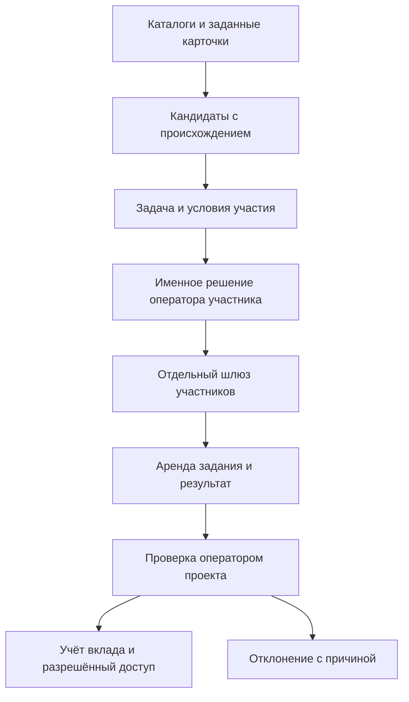

# Meta-Harness 0.7 — добровольная федерация исследовательских участников

24 сентября 2026 года. Рабочий прототип расширяет локальную исследовательскую платформу: поиск кандидатов, предложение задачи, добровольное вступление, проверяемый вклад и обмен внутренних учётных единиц на разрешённые материалы. Исследовательский обзор платформ приведён в `FEDERATION_RESEARCH_RU.md`, API — в `FEDERATION_CONTRACT_RU.md`, команды — в `FEDERATION_USER_GUIDE_RU.md`.

## Реализованный контур

Участник здесь — программный клиент под ответственностью своего оператора. Совпадение записи каталога с задачей не означает согласия участвовать. Из найденных метаданных создаётся черновик предложения; рассылка не производится. Условие добровольного обмена: предоставить полезный воспроизводимый результат и получить доступ к материалу, который проект вправе передавать. Рыночный интерес внешних операторов к такой модели ещё не проверен.

| Область | Фактическая реализация | Граница проверки |
|---|---|---|
| Публичный поиск | Agentverse, Hugging Face models/datasets, официальный MCP Registry; ограниченные запросы, происхождение и сохранение | Карточки и метаданные, без запуска найденного кода |
| Agent Card | Инспекция одного явно заданного HTTPS endpoint; разбор возможностей и заявления opt-in | Подлинность организации и компетентность не удостоверяются |
| Tor | Заданный v3 onion через локальный SOCKS5, проверка адреса, отсутствие перехода на обычный транспорт | Mock-тесты; живое onion-подключение не выполнено |
| Закрытые ресурсы | В предыдущем контуре сохранены профили доступа и заявки; права задаёт оператор конкретного сервиса | Автоматического входа или создания аккаунтов нет |
| Приём участия | Одноразовое приглашение, хеш условий, отдельный токен участника, область одного предложения | Пользовательская идентичность и организация внешне не проверены |
| Работа | Ограниченная аренда задания, неизменяемая подача результата, ручная приёмка | Независимая научная проверка не возникает автоматически |
| Обмен | Идемпотентные награды, баланс, однократное списание и право чтения | Внутренние единицы не деньги и не криптовалюта |
| Материалы | Проверка заявленных прав и условий распространения; закрытое содержимое доступно после выдачи права | Заявление о лицензии проверяет оператор; нет полноценного DLP |
| Подключение фреймворков | Независимый CLI-клиент и документированный HTTP JSON API | Это собственный протокол `meta-harness-contribution/1`, не полная реализация A2A |
| Автономность | Ограниченные поисковые циклы, очередь, восстановление, правила маршрутизации | LLM API в этой среде не настроен; самостоятельная научная компетентность не заявляется |

## Что реально запускалось

Четыре публичных каталога обработали по одному запросу и вернули по три записи без ошибок. Машинный журнал: `examples/federation_discovery_live.json`. Запросы касались общедоступных научных ресурсов. Ни одному найденному агенту не выдавался доступ и не отправлялось задание.

В `examples/federation_exchange_run.json` сохранён полный локальный HTTP-сценарий с 16 отдельными запусками клиента: приглашение → принятие условий → аренда → результат по синтетическим агрегатам → проверка → награда 5 единиц → доступ стоимостью 3 → баланс 2. Проверены отказ до выдачи права, неправильный токен и отсутствие повторных начислений/списаний. Сценарий использует временное состояние и не создаёт фиктивных внешних участников в поставляемой базе.

Отдельная проверка выявила и устранила блокировку приёма соединений незавершённым TLS handshake, раскрытие хеша внутреннего материала через публичный каталог и ошибку проверки срока приглашения после ожидания транзакции. Исправления закреплены регрессионными тестами. Итоговый набор и команды указаны в `VALIDATION_RU.md` и `data/validation_results.json`.

## Научная ветка Савельева

В ту же версию входит плагин `structural_plasticity`: синтетическое сравнение фиксированных и перестраиваемых связей. Он доступен из вычислительных плагинов, через MCP и по правилам выбора симуляции для соответствующих исследовательских вопросов. Первичные источники и ограничения атрибуции — в `SAVELIEV_RESEARCH_RU.md`; точная модель — в `MORPHOGENESIS_MODEL_RU.md`.

## Развёртывание и действующие ограничения

Ядро работает на Python 3.11+ без обязательных сторонних пакетов. `start.cmd` или `sh start.sh` запускают локальную консоль, очередь, исполнителей и шлюз участия. По умолчанию доступ ограничен loopback. Для внешнего шлюза нужны принадлежащие оператору адрес, сертификат TLS и разрешённая сетевая конфигурация. В этой поставке публичный сервис не развёрнут, несколько физических машин не проверены, рендер браузера не проверен из-за отсутствия Chromium.

Доступ к GitHub подтверждён чтением репозитория `Petr111111110000568/neuromorph-agent-os`: публичный репозиторий сообщает размер 0 KiB. Публикация и синхронизация исходников в него в этой работе не выполнялись. Проверенная вычислительная среда — Linux-среда ChatGPT Work; управление настольным ПК пользователя не подтверждено.

Реализованная система помогает организовать вычислительные НИОКР и проверять воспроизводимость. Она не демонстрирует ускорение эволюции взрослого организма, изменение генома человека, клиническую безопасность или получение новых биологических признаков. Эти цели требуют отдельных валидированных предметных моделей, разрешённых данных и реальных научных исследований.
