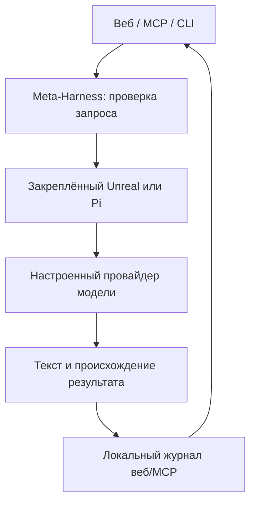

# Подключаемые AI-исполнители: поставка 0.10

Дата проверки: 24 сентября 2026 года. Репозиторий: [neuromorph-agent-os](https://github.com/Petr111111110000568/neuromorph-agent-os).

## Что реализовано

Unreal Agent и Pi подключаются через отдельные адаптеры Python-ядра. Пользователь может увидеть текущий статус, передать текст задачи, получить ответ и скачать результат с происхождением. Веб-панель находится на `/harnesses.html`; доступны HTTP API, CLI и три MCP-инструмента. Результаты веб/MCP-запусков сохраняются в SQLite с контрольной записью журнала. Исходный вопрос отдельно не сохраняется, однако модель может повторить его в ответе.

В существующий каталог добавлены Unreal, Pi и OpenHands, а в реестр источников — первичная документация их интерфейсов. Поиск и маршрутизация могут находить эти ресурсы. Карточка каталога описывает ресурс; фактическое наличие исполняемой программы проверяется через `/api/harnesses`. Автоматического привлечения сторонней организации или доступа к её аккаунтам здесь нет.

Каждый вызов использует отдельный временный каталог. Инструменты команд и файлов выключены; конфигурация проекта и унаследованные credentials не передаются. Адаптер ограничивает время, размер вывода и число параллельных веб-запусков, проверяет версии и хеши. Эти меры не являются контейнером или доказательством безопасности произвольного кода. OpenHands SDK пока не установлен; его карточка возвращает `external_worker_required`.

## Unreal: фактически проверенное

- Источник: `unreallabsai/unreal-agent`, commit `1b9f778453f411c029b39b85102aaefb95e7e48d`, MIT. Это проект Unreal Labs, отдельный от Unreal Engine.
- Runner собран с Go 1.27.1 из официального модуля toolchain. Контрольная сумма модуля закреплена; `go mod verify` и тесты двух upstream-пакетов runner прошли.
- Контрольная сумма построенного Linux/amd64 runner: `7f1bc026c0594484e5da77f1e6999fe5fa294dd799826dbb148d766299862ea2`.
- Настоящий runner вызван через `HarnessRegistry.run`. Он сделал один запрос локальному HTTP-стенду, получил SSE-ответ и вернул пять настоящих событий JSONL и ожидаемый текст. Объявленных инструментов: 0; `store=false`.
- Сохранён [машинный протокол проверки](../data/unreal_validation.json). Провайдер в нём — детерминированная фикстура, токены и ответ заданы тестом. Это проверка обмена с настоящим бинарным файлом, а не вызов настоящей модели, оценка стоимости или научный эксперимент.

Скрипты `bootstrap_unreal.py` и `smoke_unreal.py` воспроизводят установку и эту проверку. Обычная CI ядра не требует Go. Отдельный workflow `harness-protocol.yml` собирает закреплённую версию и повторяет обмен без API-ключей; результат сохраняется в artifact.

## Pi: фактически проверенное

Установлен npm-пакет `@earendil-works/pi-coding-agent` версии **0.87.1**. Версии и SRI-контрольные суммы зависимостей сохранены в `scripts/pi-package-lock.json`. Установка выполнена через `npm ci --ignore-scripts`; lifecycle-скрипты пакетов не запускались. Закреплены полный набор установленных файлов, entrypoint и Node 24.19.0; указанный upstream revision взят из метаданных npm и не означает независимую пересборку npm-пакета из исходников.

Настоящие команды `--version` и `--help` прошли как напрямую, так и через ограниченный процессный запуск Meta-Harness с минимальным окружением. CLI содержит необходимые флаги. Подтверждение: [examples/pi_validation.json](../examples/pi_validation.json). Полный модельный обмен через Pi не проверен; статусы `protocol_tested` и `live_authenticated` остаются `false`. Адаптер и разбор формата дополнительно проверены собственными тестовыми процессами.

## Использование в НИОКР

Рабочий сценарий этой версии: подготовить разрешённую публичную сводку → дать исполнителю конкретную задачу анализа или проектирования кода → сохранить ответ → проверить источники и воспроизвести вычисления существующими модулями KAN, кортикальной памяти либо отдельной реализацией. Ответ исполнителя не выполняется как программа и не становится подтверждённым научным утверждением автоматически.

Пример задачи: «По приведённым результатам сравнения KAN и MLP предложи проверку утечки между train/validation/test; перечисли контроли и ограничения». Проверяемый результат — план теста или предложение кода с обоснованием. Генерация произвольной программы сама по себе не даёт воспроизводимого результата; для её запуска требуется отдельная контролируемая среда и проверка.

Роли Brain остаются программными правилами и доверенными вычислительными workers. Внешние harness не превращены в модели отделов человеческого мозга. Ускорение эволюции взрослого организма, направленное получение признаков и клинический эффект не реализованы и не подтверждены.

## Что ещё не подтверждено

Авторизованный inference в Unreal/Pi не выполнялся: API-ключи текущему окружению не предоставлены. Подписка ChatGPT и права GitHub не являются такими ключами. Поддерживаемые альтернативные способы авторизации описаны в [сравнении](HARNESS_COMPARISON_RU.md); их наличие в документации не означает доступность этому аккаунту.

Утверждение Unreal Labs об экономии до 40% относится к [опубликованным поставщиком конфигурациям](https://unreallabs.ai/blog/unreal-agent/). Мы не воспроизводили это сравнение. В текущем профиле инструменты выключены, поэтому преимущество асинхронной работы инструментов не измеряется. Лимит времени и размера вывода не ограничивает число токенов, запросов провайдера или стоимость; `max_attempts=1` относится к повторам отдельного запроса. По этой причине ежедневный GitHub-цикл сохраняет собственный профиль с одним прямым API-запросом и не запускает свободный цикл harness.

Для Unreal выбрана reasoning-модель по умолчанию `gpt-5-mini`: runner передаёт поля reasoning в Responses API. [Официальное описание модели](https://developers.openai.com/api/docs/models/gpt-5-mini) подтверждает поддержку reasoning; доступность конкретному аккаунту и оплаченный вызов не проверялись.

## Протокол верификации

**280 тестов прошли локально.** Публикация исходников `bf6dc4b9fee75f998f0fc6212bcbc62760735306` проверена в GitHub: [Core checks — success](https://github.com/Petr111111110000568/neuromorph-agent-os/actions/runs/36047040189), [сборка и протокол Unreal — success](https://github.com/Petr111111110000568/neuromorph-agent-os/actions/runs/36047040188). Удалённая сборка дала тот же SHA256, что и две локальные сборки. Совпадение относится к проверенной Linux/amd64-конфигурации, а не ко всем платформам.

Итоговый результат проверок ядра находится в [data/validation_results.json](../data/validation_results.json), фактический снимок окружения — в [data/environment_status.json](../data/environment_status.json). Снимки содержат дату и область проверки; после клонирования используйте `python -m workbench.harnesses status` для проверки текущей установки.

Инструкция запуска: [HARNESS_INTEGRATION_RU.md](HARNESS_INTEGRATION_RU.md). Сравнение Unreal, Pi, OpenHands, Codex и Claude: [HARNESS_COMPARISON_RU.md](HARNESS_COMPARISON_RU.md).
