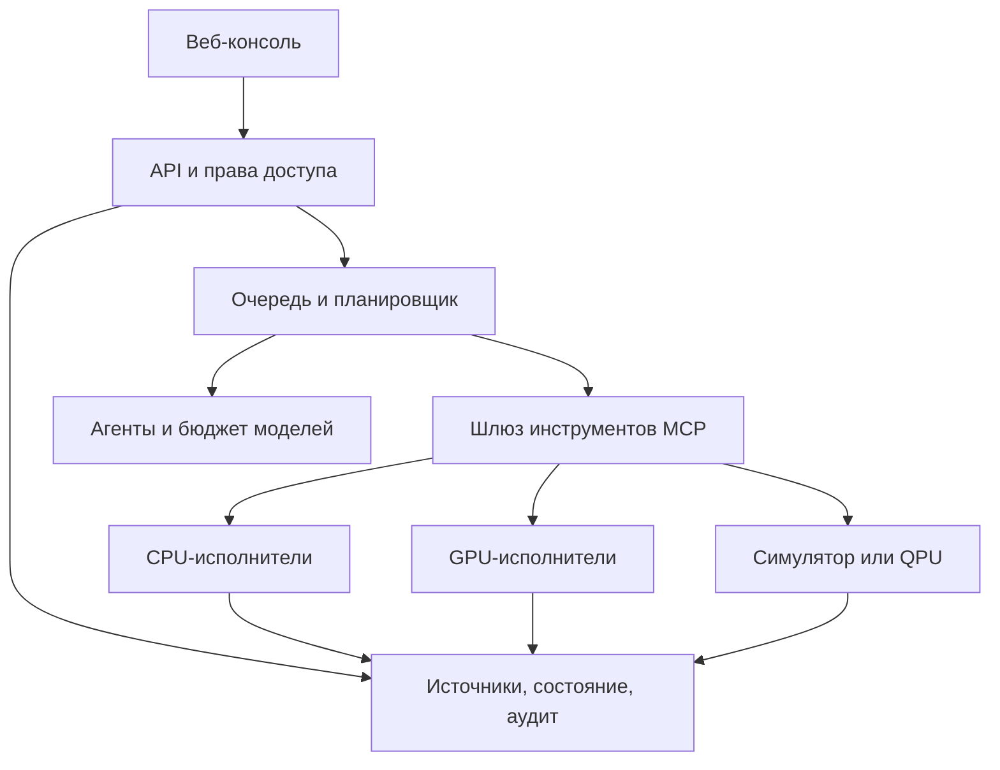

> Историческая архитектура v0.4. Для реализованной очереди, hub и workers v0.5 см. NETWORK_DEPLOY_RU.md и DELIVERY_RU.md. Указанные ниже ограничения локальной v0.4 не отменяют новые возможности v0.5.

# Meta-Harness как веб-приложение

Дата: 18 сентября 2026. Выбран рабочий формат: веб-приложение с API и отдельными вычислительными исполнителями. Статический сайт может показывать отчёт, но для сохранения заданий, длительных расчётов, доступа к моделям и прав пользователей требуется серверная часть.

## Реализованная локальная версия

Браузер → HTTP API на 127.0.0.1 → SQLite + совет правил + четыре проверенных вычислительных модуля. Встроенный MCP stdio-сервер предоставляет ограниченный профиль протокола 2025-11-25; это не заявка на полную совместимость со спецификацией 2026-07-28. Плагины исполняются в дочерних процессах с фиксированными хешами, очищенным окружением и ограничениями ресурсов. Эти меры не образуют защитную границу VM.

Восстановленная папка `srf/` сохраняет структуру v0.3. Её MCPAdapter/LegacySidecarAdapter были интерфейсными заглушками; старый ConsequenceEngine выдаёт фиксированные эвристические числа. Они сохранены как история прототипа и не подключены к новым научным вычислениям. Новый legacy_topology проверяет только полноту контракта графа.

## Целевая архитектура постоянного сервера

Секреты хранятся на сервере. Клиент получает только идентификаторы заданий и разрешённые результаты. Планировщик сохраняет переходы состояний и квоты; возобновление задания не должно повторно отправлять внешние запросы с побочными эффектами. Идентификатор модели и входные данные, версии контейнера/кода, seed, журнал инструментов и тестовые метрики входят в паспорт результата.

## Где разместить

| Вариант | Подходит для | Дополнительные условия |
|---|---|---|
| Локальный сервер из поставки | Проверка рабочего цикла и интерфейса | Python 3.11+, компьютер включён; доступ только с localhost |
| Собственный сервер/VPS | Постоянная очередь и командная работа | HTTPS, аутентификация, backup, мониторинг, секреты, проверенная изоляция |
| Sites | Интерфейс, публичные/синтетические исследовательские данные | Ограничения платформы по фоновым сервисам, приватным сетям и PHI; тяжёлые расчёты выносить отдельно |
| GPU/HPC кластер | Геномные/клеточные модели и большие серии | Отдельный бюджет, лицензии моделей, данные, планировщик и воспроизводимые образы |

Документация [Sites](https://learn.chatgpt.com/docs/sites) описывает поддерживаемые сценарии и ограничения; готовая статическая публикация сама по себе не создаёт постоянный научный вычислительный сервер. Публикация в этой поставке не выполнялась.

## Граница между ChatGPT и приложением

Персональный навык Meta-Harness организует работу агента в Work. Веб-приложение является отдельным программным продуктом; оно не получает автоматически текущую модель, подписку ChatGPT, токены GitHub или доступ к браузеру. В поставке локальный совет — восемь детерминированных ролей. Полноценный совет LLM подключается после настройки отдельного провайдера и тестирования вызовов.

Роль MCP — совместимость инструментов. Роль навыка — порядок действий. Роль планировщика — жизненный цикл задания. Роль контейнера/VM — изоляция. Эти четыре функции имеют отдельные критерии готовности.
