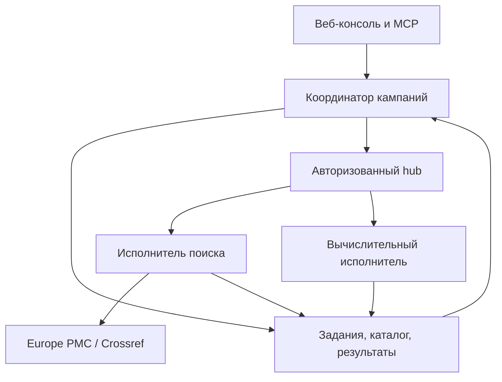

# Meta-Harness v0.5: распределённая исследовательская сеть

18 сентября 2026 года

Реализована новая программная версия с постоянной очередью и сетевыми исполнителями. Она принимает вопрос, сопоставляет локальные и внешние ресурсы, выполняет ограниченные поисковые кампании и контрольные расчёты, сохраняет происхождение результатов и уточняет план следующих итераций.

## Архитектура



Стрелки возврата обозначают логическую передачу результата: workers отправляют его через hub, прямого доступа к SQLite у них нет. Координатор один; исполнителей может быть несколько. Это не одноранговая сеть и не готовая многопользовательская облачная служба.

## Что реализовано

| Запрошенная функция | Реализация v0.5 | Граница |
|---|---|---|
| Распределённая работа | Отдельные процессы, протокол HTTPS, регистрация возможностей, аренда, heartbeat | Несколько физических машин ещё не испытывались |
| Сбор знаний | Поиск научных метаданных Europe PMC/Crossref, DOI, происхождение, дедупликация | Полные тексты и качество научного вывода автоматически не проверяются |
| Веб- и локальные ресурсы | Каталог моделей/платформ и ограниченная инвентаризация локальных файлов | Нет универсального веб-краулера или автоматической установки найденного кода |
| Метаоркестрация | Ранжирование по задачам и возможностям, планы, маршрутизация к подходящим workers | Эвристические правила; измеренной глобальной оптимальности нет |
| Самостоятельное продолжение | Фоновый координатор пересматривает результаты и ставит следующий поиск в заданном бюджете | Работает, пока запущен процесс; не создаёт новые алгоритмы и не меняет собственный код |
| Моделирование | Четыре действующих математических модуля с параметрами, seed и хешами | Контрольные примеры, а не модели желаемых изменений организма |
| Генетика/эпигенетика | Каталог возможностей и задач валидации AlphaGenome, scvi-tools, nf-core, PhysiCell и других | Исполняемые предметные адаптеры, данные и оборудование не подключены |
| Учётные записи | Профили доступа, scopes, ссылки на настройку, проверка наличия переменной credentials, журнал заявок | Нет универсального регистратора, OAuth-входа и удалённой проверки аккаунта |
| Восстановление | Постоянная очередь, идемпотентность, повтор после обрыва, отмена, сохранённые кампании | Исполнение не менее одного раза; внешний менеджер процессов отвечает за перезапуск ОС |

## Реальный проверочный цикл

Через HTTP передан вопрос `single cell epigenetics model validation`. По правилам кампании сформирован запрос `epigenetics cell state models`. Два отдельных процесса приняли разные задания: один выполнил поиск, другой — синтетический ML-бенчмарк.

Оба публичных API вернули ответы без ошибок. Сохранены 8 записей с DOI, каталог увеличился с 60 до 68. Это подтверждение сбора метаданных, а не научной достоверности всех найденных публикаций. Кампания завершилась после одной предусмотренной итерации.

На контрольной синтетической функции линейная модель дала test MSE 0,3799239643, RBF — 0,0097881448. Эти значения не относятся к клеткам, эпигенетическим изменениям или вероятности успеха вмешательства. Машиночитаемый паспорт: `examples/distributed_online_run.json`.

**67 автоматических тестов прошли.** Отдельно проверены реальная сеть процессов, сертификаты TLS, ошибки, восстановление, cancellation после частично завершённой отправки и отсутствие секретов в экспортируемом состоянии. Подробности: `docs/VALIDATION_RU.md`.

## Доступ и регистрации

Для реализованного чтения публичных метаданных регистрация не требуется. Crossref описывает публичный доступ в [документации API](https://www.crossref.org/documentation/retrieve-metadata/rest-api/access-and-authentication/); Europe PMC предоставляет [REST-интерфейс](https://europepmc.org/RestfulWebService). Фактические обращения обоих адаптеров проверены в этой среде.

Для закрытого ресурса система сохраняет профиль и заявку с причиной, официальной ссылкой и статусом. Если нужны OAuth, подтверждение личности, условия сервиса или оплата, заявка не выдаётся за успешно созданный аккаунт. Автоматическое провижининг-действие возможно только через отдельный адаптер конкретного API с уже предоставленными полномочиями; такие адаптеры в v0.5 не заявлены готовыми.

Значения секретов не принимаются через интерфейс. Профиль содержит только имя серверной переменной и требуемые полномочия. Общий токен hub авторизует доверенную группу исполнителей и не является персональной системой доступа организаций.

## Запуск и развёртывание

После распаковки архива, при наличии Python 3.11+:

```bash
python3 -m workbench local-network
```

Открыть `http://127.0.0.1:8765/network.html`. Для Windows предусмотрен `start.cmd`. Постоянная очередь и два workers запускаются вместе. Вкладку можно закрыть: кампания продолжается до бюджета, пока процессы работают. Ctrl+C завершает локальную сеть.

Для разных компьютеров отдельно запускаются UI, hub с TLS-сертификатом, daemon и workers. Команды и требования приведены в `docs/NETWORK_DEPLOY_RU.md`. Публичный сайт и облачная инфраструктура в ходе этой работы не развёртывались.

Исходники не включают рабочие базы, токены или виртуальное окружение. Для переноса состояния остановите систему и скопируйте весь каталог состояния. JSON-экспорт предназначен для отчёта и анализа, не для автоматического восстановления базы.

## Следующий инженерный предел

Сеть исполняет два типа операций: поиск метаданных и закреплённые вычислительные модули. Для предметных научных расчётов следующий конкретный шаг — один проверенный внешний worker на публичном контрольном наборе, например single-cell анализ; затем независимая проверка качества и только после неё расширение каталога исполняемых адаптеров.

Запрос желаемых признаков организма сейчас формирует исследовательскую программу поиска и оценки моделей. Перевод такого запроса в безопасный генетический или эпигенетический план не реализован и не подтверждён имеющимися вычислительными тестами.
